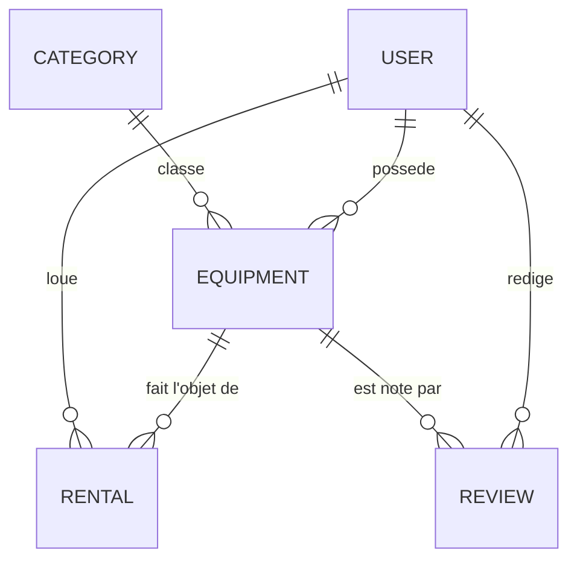

# GearShare API - Plateforme de Location de Matériel

API RESTful moderne et robuste développée avec **FastAPI** et **Pydantic V2** pour la gestion d'une plateforme communautaire et professionnelle de location de matériel (audiovisuel, outillage de bricolage, équipement de camping).

---

## Architecture des Ressources et Relations

Le système gère **5 ressources interconnectées** avec relations d'intégrité référentielle en mémoire :



1. **Category** : Familles d'équipements (`id`, `name`, `description`).
2. **User** : Utilisateurs propriétaires et locataires (`id`, `full_name`, `email`, `phone`, `hashed_password`, `is_active`).
3. **Equipment** : Matériel mis en location avec liste d'accessoires imbriqués (`id`, `name`, `description`, `category_id`, `owner_id`, `daily_rate`, `security_deposit`, `status`, `accessories`).
4. **Rental** : Réservations de matériel (`id`, `equipment_id`, `renter_id`, `start_date`, `end_date`, `status`, `total_cost`, `internal_notes`).
5. **Review** : Avis et évaluations (`id`, `equipment_id`, `author_id`, `rating`, `comment`, `created_at`).

---

## Paliers Réalisés

- **Palier 1 (Fondations)** :
  - 5 ressources distinctes et 4 relations logiques inter-ressources.
  - CRUD complet (`POST`, `GET`, `GET /{id}`, `PATCH`, `DELETE`) pour chacune des 5 ressources.
  - Documentation Swagger interactive accessible sur `/docs`.
- **Palier 2 (Validation approfondie)** :
  - Contraintes `Field` (`min_length`, `max_length`, `ge`, `le`, `gt`).
  - 2 `Enum` stricts (`EquipmentStatus`, `RentalStatus`).
  - 2 `field_validator` (format regex téléphone, validation anti-chaîne vide).
  - 2 `model_validator` multi-champs (caution >= tarif journalier, cohérence temporelle `end_date >= start_date`).
  - Sous-objets imbriqués : liste d'objets `Accessory` dans `Equipment`.
  - Champs optionnels avec valeurs par défaut.
- **Palier 3 (Fonctionnalités avancées)** :
  - Filtrage multi-critères (`category_id`, `status`, `min_rate`, `max_rate`, `search`).
  - Pagination (`limit`, `offset`).
  - Tri ascendant/descendant (`sort_by=daily_rate`, `sort_by=-daily_rate`, etc.).
  - Route d'agrégation statistique dynamique `GET /stats`.
- **Palier 4 (Qualité et robustesse)** :
  - `HTTPException` ciblées (400, 404, 422) sur les cas limites et l'intégrité relationnelle.
  - `response_model` sécurisés masquant les données sensibles (`hashed_password` utilisateur, `internal_notes` de réservation).
  - Documentation complète (`README.md`, `JOURNAL.md`, `TESTS.md`).
- **Palier 5 (Défis bonus)** :
  - Duplication en profondeur de ressource avec sous-objets (`POST /equipment/{id}/duplicate`).
  - Export CSV pur Python sans librairie externe (`GET /equipment/export/csv`).
  - Recherche globale multi-ressources unifiée (`GET /search?q=...`).
  - Détection anti-chevauchement des dates de réservation sur un même matériel.

---

## Installation et Démarrage

### Prérequis
- Python 3.10+

### Installation
```bash
pip install -r requirements.txt
```

### Lancement du serveur d'API
```bash
python main.py
```
L'API est accessible sur `http://localhost:8000`.  
La documentation interactive Swagger est disponible sur `http://localhost:8000/docs`.

### Exécution des tests automatisés
```bash
pytest tests/test_api.py -v
```
